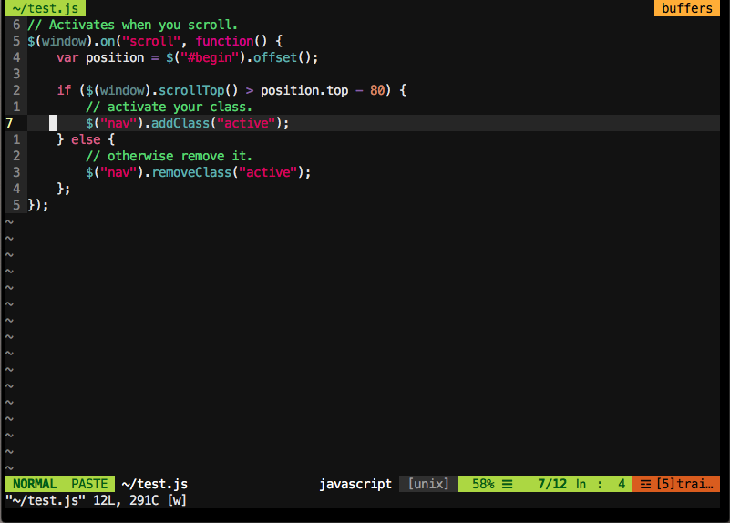

# Xcode Civic Color Scheme for VIM

## Civic

## Civic (Transparent Background)

## Credit

This colorscheme was initially generated by converting antoineboulanger's [Civic Color Scheme](https://github.com/antoineboulanger/civic)
for TextMate to VIM using [Coloration](https://github.com/sickill/coloration) by Marcin Kulik.
This colorscheme is originally based from Apple's Xcode Civic theme.

It was slightly altered to have more contrast and brighter colors.

## Installation

Copy `Civic.vim` or `Civic_TransparentBackground.vim` to your `~/.vim/colors/` folder (Create it if it doesn't exist).

Make sure to add `set t_Co=256` to your `~/.vimrc` file to enable 256 colors.
Or `set termguicolors` to enable truecolor support if your terminal supports it.

## Notes

- Enable bold fonts in your terminal for better highlighting.
- Works well with [vim-javascript](https://github.com/pangloss/vim-javascript) for JavaScript syntax highlighting.
- Looks great with [terminal-snazzy](https://github.com/sindresorhus/terminal-snazzy) or [iterm-snazzy](https://github.com/sindresorhus/iterm2-snazzy).
